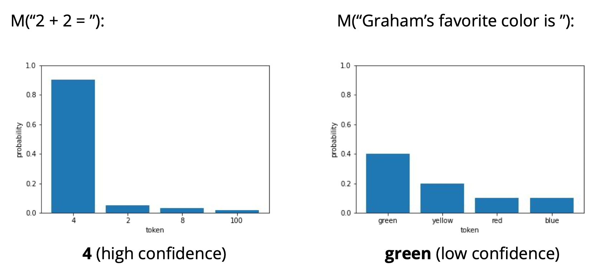
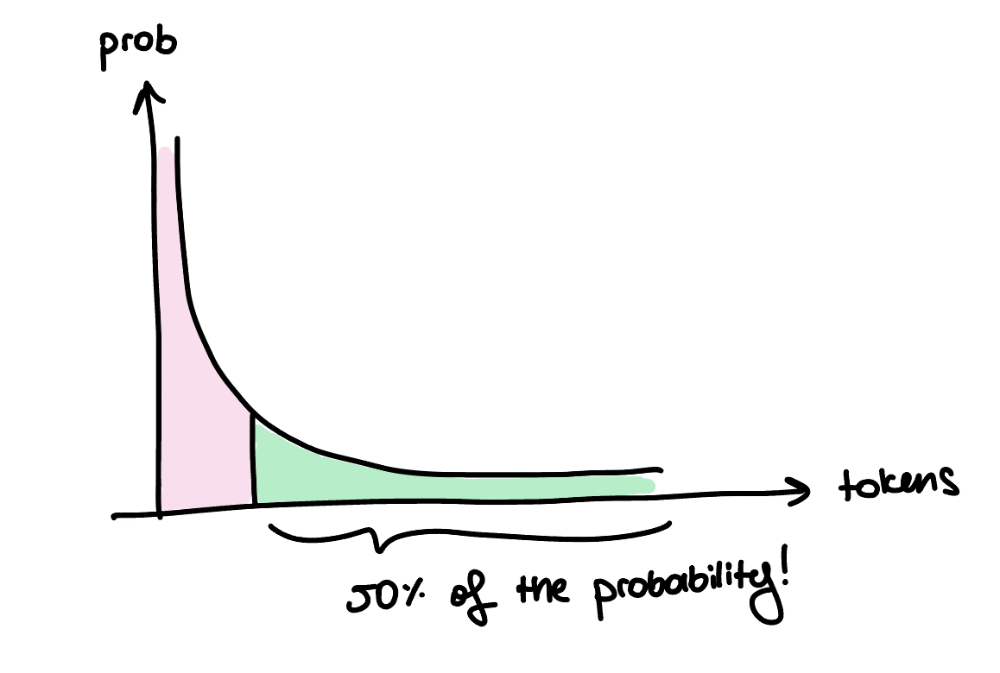

We always hear that language models use **next-word prediction** to generate outputs, which indicates that language models define a conditional probability distribution. When the model is prompted to complete the text ‘2+2=', the probability mass for the next word will be most likely be concentrated on 4. Then, with the **simplest strategy**, we chose the most probable token to complete the text. Thus, the completed sentence becomes '2+2=4’. However, as can be seen in Figure 1, a more open-ended generation would produce a flatter distribution since any of the options can be used to complete the sentence. In such cases, we might consider using some sampling methods to produce the next-token prediction, and this can result in diverse but semantically meaningful sentences each time you get a prediction.

## How models hallucinate?
One downside of this approach roots from the fact that model always gives non-zero probabilities to wrong answers, as you can see from the first bar plot in Figure 1. 2, 8 and 100 have non-zero probabilities assigned to them. Thus, if you use a sampling approach to get diverse results from the model, you might sample 2, 8 or 100 with a small probability. And as LLM continues to generate and complete your sentence, the conditional probability distribution build upon the mistake.
By looking at the figure, you might say here that if I pick the most probable answer then I would minimize the hallucination probability. Unfortunately, this might not always be the case. If you use an out-of-distribution prompt or if the training dataset has inaccuracies or out-dated information, then the model might inherently produce factually wrong answers. This work also asserts that even if you use a factually correct training set with perfect training data, the hallucination problem will stay [[1]](https://arxiv.org/pdf/2311.14648.pdf).

<figure>
    
    <figcaption>Figure 2: Long tail distribution we obtain when we use the exact probability distribution constructed by the language model.</figcaption>
</figure>
